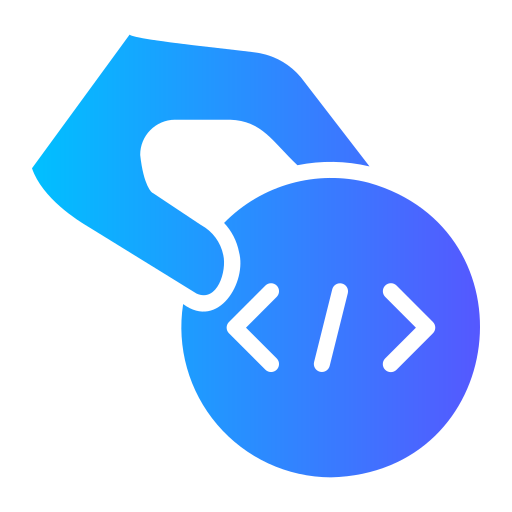

# Conta Meu Código 🚀

## 💭 Sobre o Projeto

Este projeto nasceu de uma simples curiosidade: "Quantas linhas de código eu realmente escrevi no meu projeto?". Cansado de contar manualmente e ignorar arquivos de bibliotecas, decidi criar uma ferramenta que fizesse isso por mim.

O que era para ser um simples contador acabou evoluindo para uma ferramenta visual que me ajuda a entender melhor a composição dos meus projetos.

## ✨ O que ele faz?

- 📊 **Conta linhas de código** (ignorando node_modules e outras libs)
- 🎨 **Identifica linguagens** usadas no projeto
- 💬 **Separa comentários** do código
- 📈 **Mostra gráficos** para visualizar melhor a distribuição do código
- 📁 **Analisa pastas inteiras** de uma vez

## 🛠️ Construído com

Usei algumas tecnologias que já estava estudando:

- **React** - Porque já estava familiarizado
- **TypeScript** - Para praticar tipagem
- **TailwindCSS** - Para estilizar rapidamente
- **Chart.js** - Para os gráficos bonitinhos
- **Framer Motion** - Para umas animações legais
- **Vite** - Porque é rápido demais!

## 🎯 Para que serve?

Principalmente para satisfazer a curiosidade de desenvolvedores que, como eu, querem saber:
- Quanto código realmente escreveram
- Quais linguagens mais usam
- Como está distribuído o código no projeto

## 📝 Licença

Projeto sob licença MIT - pode usar à vontade! 😉

---

⭐️ Feito com ❤️ e muita curiosidade
